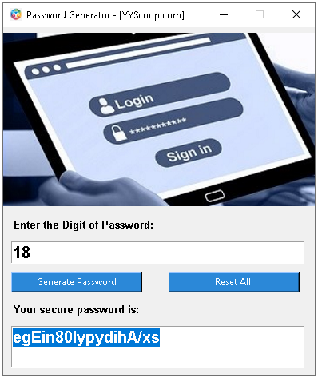

## Password Generator
> `Password Generator` is a script that generates a secure and strong password with custom length.

## Usage

1. Open your Terminal/cmd

2. git clone this project to your preferred directory.

3. `cd password-generator`

4. `PasswordGenerator.py`

<br/>

or Execute:

```
ExecutePasswordGenerator.cmd
```



## Installation
Set up a virtual environment and install the dependencies:
```sh
pip install -r requirements.txt
```

## License
This project is licensed under the terms of the [MIT license](https://github.com/yogesh7132/password-generator/blob/master/LICENSE).
